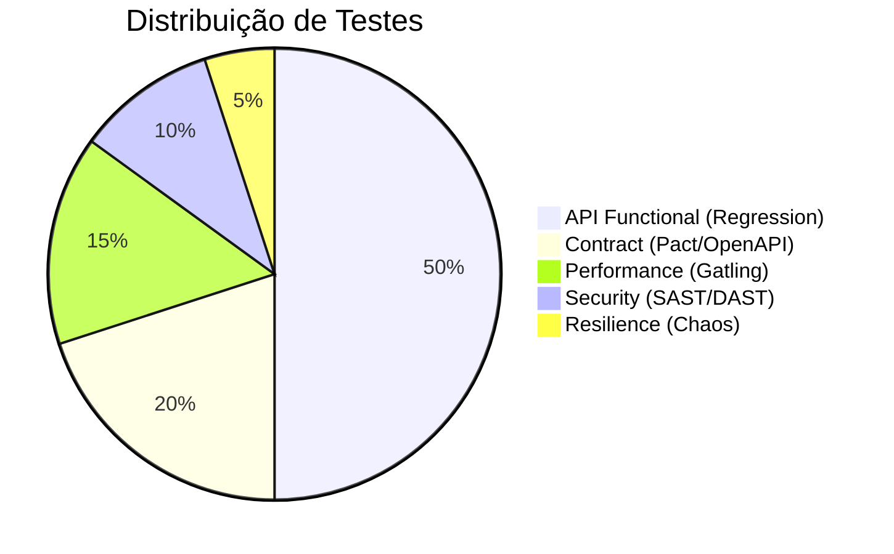

# Estratégia de Qualidade (Test Strategy)

Este documento define a abordagem estratégica para garantir a qualidade, confiabilidade e performance da API ServeRest.

## 🏛️ Política de Qualidade
Nosso objetivo é garantir que a API ServeRest atenda aos requisitos funcionais, não funcionais e de segurança com alta confiabilidade e performance, permitindo deploys frequentes e seguros.

### Escopo dos Testes
- **In Scope**: Fluxos críticos de e-commerce (Login, Produtos, Carrinho), integridade de dados, performance sob carga normal e picos, segurança de dependências.
- **Out of Scope**: Testes de UI (foco em API-First), Testes de usabilidade, Testes de penetração profundos (apenas scan automatizado).

### Risco e Cobertura
Focamos em cobrir riscos de negócio críticos:
- **Perda de Receita**: Falhas no checkout/carrinho.
- **Segurança**: Vazamento de dados de usuários.
- **Disponibilidade**: Lentidão extrema sob carga.

---

## 🎯 Pirâmide de Testes

A distribuição dos testes segue uma estratégia equilibrada para maximizar feedback rápido e cobertura de risco.

### 1. Testes de Contrato (Contract Testing)
- **Ferramenta**: Pact JVM & Swagger Validator.
- **Objetivo**: Garantir que as mudanças na API não quebrem consumidores (Frontend/Mobile).
- **Frequência**: Pré-merge (PR Check).

### 2. Testes Funcionais (API Regression)
- **Ferramenta**: JUnit 5 + RestAssured.
- **Objetivo**: Validar regras de negócio, fluxos de carrinho e integridade de dados.
- **Estratégia de Dados**: `DataFactory` com UUIDs para paralelismo seguro.

### 3. Testes de Performance (Load Testing)
- **Ferramenta**: Gatling Java SDK.
- **Objetivo**: Garantir SLA de latência (p95 < 500ms) sob carga.
- **Cenário**: Carga constante e picos (Stress Testing).

### 4. Testes de Segurança (Security)
- **Ferramenta**: OWASP Dependency Check.
- **Objetivo**: Identificar bibliotecas vulneráveis antes do deploy.

---

## 🏗️ Ambientes de Teste

| Ambiente | Descrição | Tecnologia | Dados |
| :--- | :--- | :--- | :--- |
| **Local** | Máquina do desenvolvedor | Docker Compose (ServeRest + WireMock + Jaeger) | Voláteis (criados na hora) |
| **Pipeline (CI)** | GitHub Actions | Testcontainers (Ephemeral) | Voláteis (isolados por container) |
| **Staging** | Ambiente compartilhado | Kubernetes | Dados de massa controlada |

---

## 🛡️ Quality Gates (CI Pipeline)

O pipeline falha se qualquer um dos critérios abaixo não for atendido:

1.  **Testes**: 100% de sucesso (0 falhas).
2.  **Cobertura**: Mínimo 80% de linhas cobertas (JaCoCo).
3.  **Qualidade**: Mutation Score > 70% (PITest).
4.  **Performance**: p95 Response Time < 500ms (Gatling).
5.  **Segurança**: Nenhuma CVE com score > 7.0.
6.  **Confiabilidade**: Zero *Flaky Tests* detectados.

---

## 🧪 Gestão de Flaky Tests

Para garantir confiança na suíte:
1.  **Detecção**: Script `FlakinessReport` analisa logs de execução em busca de retries.
2.  **Ação**: Testes intermitentes são quarentenados e corrigidos, não ignorados.
3.  **Prevenção**: Uso de `Testcontainers` garante ambiente limpo a cada execução, eliminando poluição de dados.
